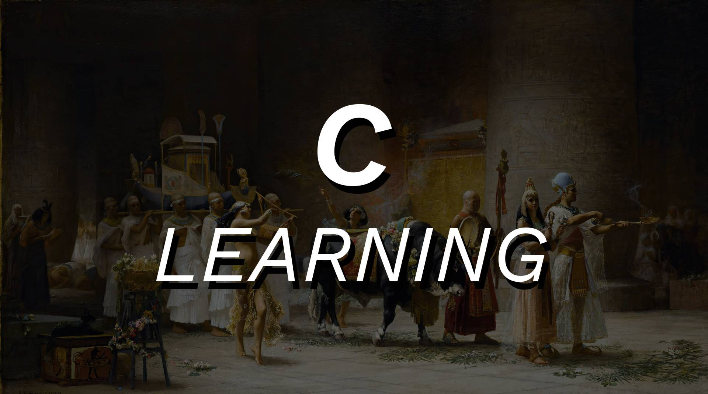

 

    
    
    
    
    

C-learning is my personal personal repository where I cover the most basic C topics such as data manipulation, loops, structs, functions, macros and headers.

 

:bookmark_tabs: Table of Contents
-----
* [Exercises](#books-exercises)
* [Author](#smiley-author)
* [License](#scroll-license)
-----

 

:books: Exercises
---

<b>Basic data manipulation</b>
- 01 - Character declaration
- 02 - String basics 

<b>Operators</b>
- 03 - Assignment operators
- 04 - Equality operators
- 05 - Relational operators
- 06 - Logical operators
- 07 - Standard evaluation order
- 08 - Undefined evaluation order

<b>Loops</b>
- 09 - Loop basic
- 10 - Loop infinite
- 11 - Break and continue

<b>String manipulation</b>
- 12 - Character handling
- 13 - Character count
- 14 - Checking string sizes
- 15 - Copying strings
- 16 - String concatenation
- 17 - Reverse copying strings
- 18 - Occurrence finder
- 19 - String splitting
- 20 - String splitting into tokens
- 21 - String splitting into tokens when the occurrence is a string

<b>Arrays</b>
- 22 - One-dimensional array
- 23 - Two-dimensional array

<b>Memory allocation</b>
- 24 - Sizeof
- 25 - Basic memory allocation
- 26 - Memory allocation with memset

<b>Structs</b>
- 27 - Basic struct
- 28 - Struct initialization
- 29 - Typedef
- 30 - Struct pointer

<b>Functions</b>
- 31 - Basic functions
- 32 - Function parameters
- 33 - Function using return
- 34 - Basic string functions
- 35 - String return functions
- 36 - Function returning string with parameters
- 37 - Function prototype

<b>Defines</b>
- 38 - Using define
- 39 - Define replacing with large code
- 40 - Define parameters
- 41 - Define multiple parameters
- 42 - Define using do while

<b>Headers</b>
- 43 - Basic includes
- 44 - Using headers - functions
- 45 - Using header - static functions

 

:smiley: Author
---

Twitter: [Albrechtcolia](https://twitter.com/albrechtcolia) 

 

:scroll: License
---

[MIT license](license)

